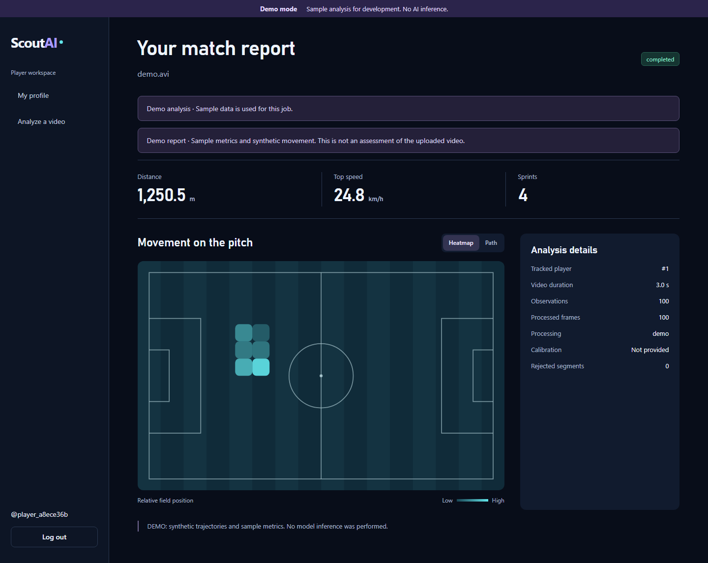
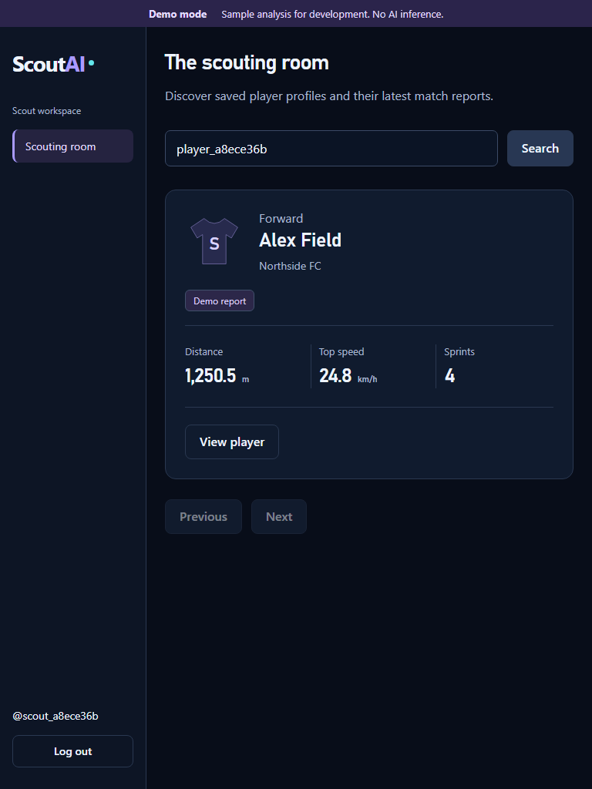

# ScoutAI

Football scouting and player movement analysis, restored from the original React and computer-vision prototypes. Upload a clip, track players, select your ID and save a report. Scouts browse real saved player profiles and completed analyses.

**Demo mode is explicit. Real mode runs YOLO pose and tracking.** Uncalibrated real video produces image-space movement; metre distance, km/h speed and sprint estimates require manual field calibration. There are no claims of accuracy, real-time performance or concurrent-video throughput.

## Features

* Player/scout registration, Argon2 password hashes, expiring JWT sessions and server-side authorization.
* Player profile editing, validated MP4/MOV/AVI upload, persisted progress, player gallery and selection.
* Durable local worker, restart recovery, failure reporting, source-video cleanup and bounded input sizes.
* Selected-player movement/heatmap, calibrated distance/speed/sprints, annotated detection preview.
* Scout directory, search, player details and recent saved reports from the database.
* Responsive navy/violet/cyan interface, labelled controls, keyboard focus and visible demo labels.
* GPU-free API/geometry tests and full Chromium demo E2E. A separate actual-inference smoke script.

## Architecture and tech stack

React 19 + Vite + React Router + Axios → FastAPI → SQLAlchemy database → one Python worker → OpenCV / Ultralytics YOLO11 pose / BoT-SORT / Supervision / NumPy. Python **3.12** is the supported project baseline; use Node **22.12+**, preferably Node 22 LTS. The actual Windows run used Python 3.12 and Node 25.8; CI selects Node 22.

SQLite is the zero-service local default. PostgreSQL uses the same SQLAlchemy models and the psycopg driver. No GPU, PostgreSQL, Docker, Celery or model download is needed for demo mode. Run the worker as a separate process so inference does not block API requests. One worker owns the upload directory through an OS file lock; multi-host workers are outside the current design.

```
backend/
  app/api/         API and authorization boundaries
  app/core/        configuration, JWT, passwords, request limits
  app/db/          SQLAlchemy engine/session setup
  app/models/      User, PlayerProfile, AnalysisJob
  app/schemas/     validated request contracts
  app/services/    video inspection, detection and reporting
  app/cv/          restored processor, geometry, analytics and visualizers
  app/worker.py    durable queue consumer and cleanup
  tests/          pytest coverage
  requirements*.txt
frontend/src/
  api/ components/ hooks/ pages/ styles/
scripts/          setup, fixture, browser and real-CV smoke tests
docs/             audit, provenance, API, design and validation
.github/workflows/ci.yml
```

## Quick start: Windows PowerShell

Install Python 3.12 and Node 22 first. These commands start from a clean clone of the restoration branch:

```powershell
git clone --branch revive/scout-ai https://github.com/alinur527/Scout.AI.git
Set-Location Scout.AI
powershell -ExecutionPolicy Bypass -File .\scripts\setup.ps1
```

The setup script creates `.venv`, installs base/dev and frontend dependencies, and creates ignored `backend/.env` with a random JWT secret and `SCOUTAI_DEMO_MODE=true`. It never overwrites an existing `.env`. ExecutionPolicy applies only to this script invocation. No venv activation is required.

Open three PowerShell terminals at the clone root:

**API:**

```powershell
Set-Location backend
..\.venv\Scripts\python.exe -m uvicorn app.main:create_app --factory --host 127.0.0.1 --port 8000
```

**Worker:**

```powershell
Set-Location backend
..\.venv\Scripts\python.exe -m app.worker
```

**Frontend:**

```powershell
Set-Location frontend
npm run dev -- --host 127.0.0.1
```

Open [ScoutAI](http://127.0.0.1:5173), [API health](http://127.0.0.1:8000/health) or [OpenAPI](http://127.0.0.1:8000/docs). Register a player, log in, fill the profile and upload video. After detection choose an ID and click **Build my report**. Log out and register a scout to find that player. No accounts or test players are seeded automatically. Stop servers with Ctrl+C.

To create a small valid **synthetic test video**:

```powershell
.\.venv\Scripts\python.exe scripts/make_demo_video.py
```

Upload `test-artifacts/demo.avi` in demo mode. It is not a football evaluation dataset.

## Manual backend/frontend setup

```powershell
py -3.12 -m venv .venv
.\.venv\Scripts\python.exe -m pip install --upgrade pip
.\.venv\Scripts\python.exe -m pip install -r backend/requirements-dev.txt
Copy-Item backend/.env.example backend/.env
$key = & .\.venv\Scripts\python.exe -c "import secrets; print(secrets.token_urlsafe(48))"
$configuration = Get-Content backend/.env -Raw
$configuration.Replace('JWT_SECRET_KEY=', "JWT_SECRET_KEY=$key") | Set-Content backend/.env -Encoding utf8
Set-Location frontend
npm ci
```

Run the manual copy only for a new environment; keep existing signing keys and databases. For an API-only runtime, install `backend/requirements.txt`. Frontend uses the default API URL or optional `frontend/.env` copied from `.env.example`. All API calls use this one configuration; there are no component-specific base URLs.

## Environment variables

API and worker read `backend/.env` when launched from `backend/`. Process environment takes precedence.

| Variable | Meaning / default |
|---|---|
| DATABASE_URL | `sqlite:///./data/scoutai.db`; PostgreSQL URI with driver prefix `postgresql+psycopg` is supported |
| JWT_SECRET_KEY | Required random secret, minimum 32 characters; no default |
| JWT_ALGORITHM | HS256 only; other values rejected |
| ACCESS_TOKEN_EXPIRE_MINUTES | 120 |
| CORS_ORIGINS | JSON list of explicit origins; defaults permit localhost and 127.0.0.1 port 5173; wildcard rejected |
| UPLOAD_DIR | `./data/uploads`; API/worker must share it |
| MODEL_WEIGHTS | `./weights/yolo11n-pose.pt`; local file required in real mode |
| SCOUTAI_DEMO_MODE | Default false in code; `.env.example` deliberately sets true; legacy alias DEMO_MODE also accepted |
| MAX_UPLOAD_MB | 200; streaming and multipart-body limits enforced |
| MAX_VIDEO_SECONDS | 1800 (30 minutes); trim longer clips |
| MAX_VIDEO_FRAMES | 54000 |
| JOB_RETENTION_DAYS | 7; expire unfinished jobs and remove old gallery/raw tracks; completed reports remain |
| VITE_API_BASE_URL | Frontend only; defaults to `http://localhost:8000`; set before build |

## Database and background jobs

Tables are created automatically for this initial schema. `User` owns one `PlayerProfile` and many `AnalysisJob` records. Jobs store state, timestamps, mode, gallery, sampled trajectories, selected ID, calibration and final JSON result. They survive browser refresh and API restarts. `create_all` is not a migration system: future schema changes require a reviewed migration, ideally Alembic. Back up your database before upgrades.

To use PostgreSQL, create a database/account externally and put its URI in DATABASE_URL; no hardcoded credentials are supplied. PostgreSQL runtime was not available for local validation. SQLite is tested. Keep the database and UPLOAD_DIR consistent between API and worker. Launch only one worker; another instance exits with a clear lock error. Queued jobs survive restarts; interrupted active inference is marked failed, and users re-upload. Jobs waiting for selection survive worker restarts.

Source uploads are deleted after detection because the database already contains the required gallery, preview and trajectories. Failed inputs are deleted as well. Worker startup/hourly cleanup expires old unfinished jobs and orphaned uploads. Reports remain until database maintenance; automatic account/report deletion is planned.

## Demo mode

`SCOUTAI_DEMO_MODE=true` uses the same authentication, upload validation, queue, gallery selection, report API and UI as real mode. The worker deliberately returns deterministic sample players/metrics. Every job/result records its demo flag and the UI labels it. There is no fallback from failed real inference to demo. Changing mode does not relabel previously created jobs.

## Real AI/CV mode and model weights

Install the CPU stack (the project was smoke-tested with this pair):

```powershell
.\.venv\Scripts\python.exe -m pip install torch==2.10.0 torchvision==0.25.0 --index-url https://download.pytorch.org/whl/cpu
.\.venv\Scripts\python.exe -m pip install -r backend/requirements-cv.txt
.\.venv\Scripts\python.exe scripts/download_model.py
```

The explicit download script retrieves the official YOLO11n-pose checkpoint (~6.3 MB), bounds the download size and saves it under ignored `backend/weights/`. The server never downloads a model implicitly. Missing/wrong weights fail clearly. Only load trusted model checkpoints.

Set `SCOUTAI_DEMO_MODE=false` in `backend/.env`, keep MODEL_WEIGHTS correct, then restart API and worker. CUDA is auto-selected when the installed Torch build reports CUDA available; otherwise the processor uses CPU and disables half precision. For GPU installation choose a matching torch/torchvision build from the [official PyTorch installation guide](https://pytorch.org/get-started/locally/). The local validation machine used CPU; CUDA was not exercised. Tracking follows the [Ultralytics tracking API](https://docs.ultralytics.com/modes/track/).

### How video analysis works

1. Validate upload extension, MIME, actual decoding, FPS, duration, frame count and resolution; create a queued DB job.
2. Worker streams OpenCV frames through YOLO pose and BoT-SORT, extracts ankle positions (bbox-bottom fallback), saves crops and approximately 10 observations/second per track.
3. UI polls status and shows gallery. Select yourself. A track is not a verified personal identity; occlusion can split it.
4. Optionally mark four visible corners of a known rectangular field region in perimeter order and enter its actual metre dimensions. Fixed camera is required. A first-frame preview and keyboard coordinate input are provided.
5. Build the selected-track report from the saved observations. Manual homography + time-aware smoothing yields estimated distance/speed/sprints. Discontinuities are rejected, not clipped into fabricated metrics. Heatmap is specific to the selected player.
6. Store the completed report. Scouts can view it on the player's detail page.

Without calibration, **distance, speed and sprints are unavailable**, while image-space movement remains useful. Pose weights do not detect a football. Goals, assists and possession are not implemented.

## API contract

See [docs/API.md](docs/API.md) for payloads, authorization, statuses and calibration. Main endpoints: `/health`, `/auth/register`, `/auth/login`, `/profile/me`, `/analyses`, `/analyses/{id}/status`, `/players`, `/players/{id}` plus gallery/selection/run/result routes. Frontend, tests and docs use this same contract.

## Testing

From the root, with setup complete:

```powershell
Set-Location backend
..\.venv\Scripts\python.exe -m pytest -q
..\.venv\Scripts\python.exe -m ruff check app tests ../scripts
..\.venv\Scripts\python.exe -m compileall -q app
Set-Location ../frontend
npm ci
npm run lint
npm run build
npm audit
Set-Location ..
.\.venv\Scripts\python.exe -m playwright install chromium
.\.venv\Scripts\python.exe scripts/test_e2e.py
.\.venv\Scripts\python.exe scripts/smoke_real.py
.\.venv\Scripts\python.exe scripts/check_repository.py
```

E2E requires free ports 8000/5173 and starts isolated API/frontend/worker processes with a temporary DB; it does not touch local development accounts. It registers a player, edits profile, uploads, observes queued/processing, selects, completes and refreshes a report, then registers a scout, searches and opens the saved player. It also checks role guards, a missing route and invalid JWT. Screenshots at 1440, 768 and 390 px plus logs/results go to ignored `test-artifacts/`.

`smoke_real.py` requires CV dependencies and downloaded weights. It builds a short video from Ultralytics' bundled image of people, runs actual inference and verifies a persisted result. This confirms pipeline execution, **not football accuracy**. GitHub Actions runs backend/frontend/demo E2E without GPU or model weights. Actual run outcomes and warnings are recorded in [docs/VALIDATION.md](docs/VALIDATION.md).

## Known limitations

* No football dataset, ground truth, accuracy benchmark, load benchmark or CUDA validation was available. Camera motion, occlusion, low resolution and bad calibration affect estimates.
* One worker, local media storage, no distributed lease/queue, cancellation or automatic retries. Requests need an external rate limit and TLS boundary before an internet-facing deployment.
* Self-registration permits player/scout; admin is preserved as a role but cannot self-register. No advanced admin panel, password reset, email verification or refresh tokens.
* Scout accounts can discover all registered player profiles and completed reports. Private profiles/consent controls are not yet implemented.
* PostgreSQL configuration/driver exist but live PostgreSQL testing and production migrations remain unverified. SQLite local/E2E is tested.
* Short reports follow a single track ID. No cross-clip identity/reidentification, ball analytics, goals or assists. 4K/240 FPS maxima and clip length/frame limits apply.
* Upstream libraries emit deprecation warnings during tests/inference; details in validation. Browser happy-path errors are checked separately.

## Roadmap

Calibrated football validation with ground truth; track correction/reidentification; profile privacy and account deletion; Alembic migrations and live PostgreSQL coverage; queue cancellation/retry; performance measurements. Telegram Mini App is a later integration, not part of this web restoration.

## Screenshots

Generated by the real browser flow in demo mode:




The test script also captures mobile versions; see `test-artifacts/e2e/` after a run.

## History and acknowledgements

Restored from [Isaksend/ai-scouter](https://github.com/Isaksend/ai-scouter) and [Isaksend/scout_ai_front](https://github.com/Isaksend/scout_ai_front). The original target commit is preserved. [Provenance](docs/PROVENANCE.md) records exact source SHAs and imported paths; [audit](docs/AUDIT.md) records defects and retained algorithms. Neither upstream was modified. No LICENSE is invented for source whose licensing was not supplied. The owner must resolve redistribution rights, including applicable [Ultralytics licensing](https://www.ultralytics.com/license), before wider distribution.
