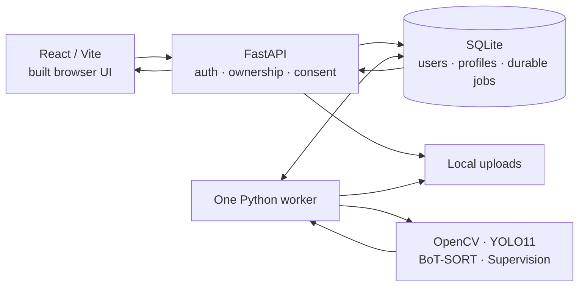
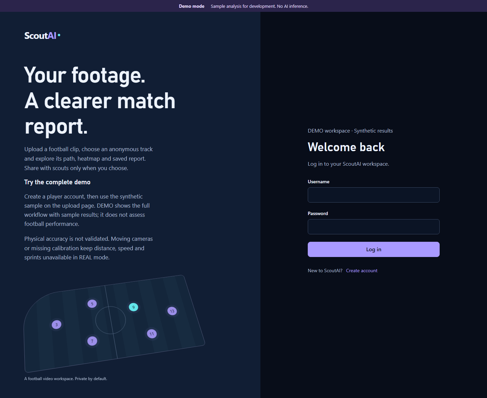
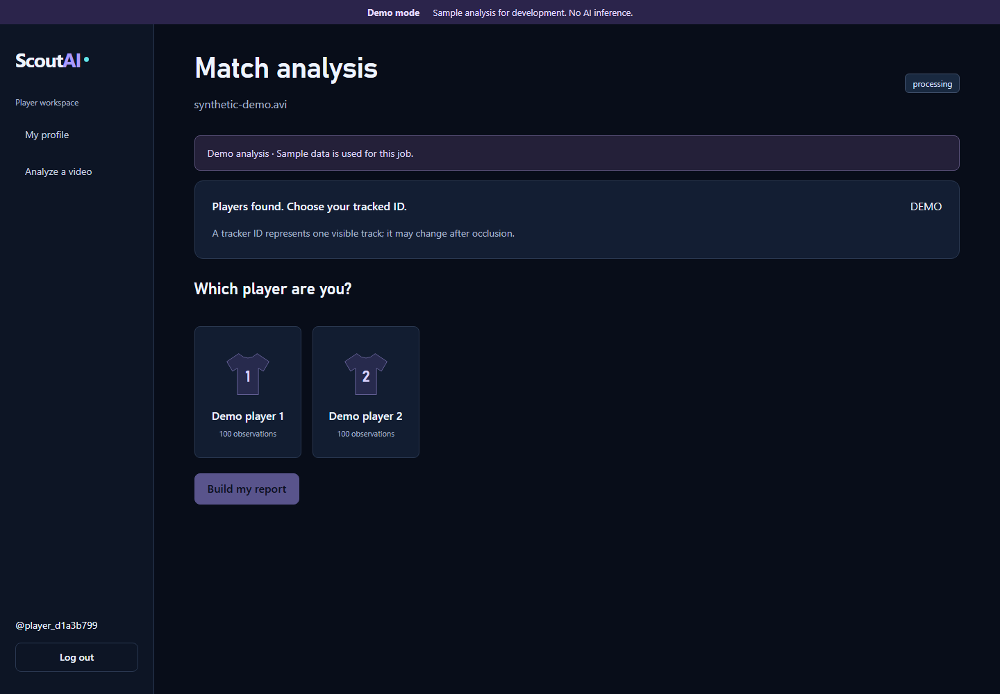

# ScoutAI

[](https://github.com/alinur527/Scout.AI/actions/workflows/ci.yml)
[Release status](https://github.com/alinur527/Scout.AI/releases) · [Demo script](docs/PORTFOLIO.md) · [Validation](docs/VALIDATION.md)

ScoutAI is a local football video workspace: upload a clip, choose an anonymous player track, and explore its trajectory, heatmap and saved report. Players control whether scouts can discover their profile and completed reports. Restored from team prototypes, the application combines a React interface with a persistent Python CV worker.


*Actual application screenshot from the isolated DEMO browser test. All shown metrics and movement are synthetic.*

## What you can do

- Register as a player or scout, sign in, and maintain a private player profile.
- Try the built-in synthetic sample without model weights, or explicitly enable local REAL inference.
- Upload MP4/MOV/AVI, follow the actual processing stage, inspect detected people and select one track.
- Reopen saved analyses from paginated history; view preview, path, heatmap, metadata and limitations.
- Export a protected JSON report or print/save PDF through the browser.
- Explicitly share a profile with registered scouts, then revoke future access to its reports and exports.

**DEMO** checks the complete application flow using synthetic results. **REAL** runs YOLO/BoT-SORT on local video; it never falls back to DEMO. A track ID is not a verified identity. Physical accuracy is **not validated**; unsupported calibration, moving/uncertain cameras and unreliable timestamps keep physical metrics unavailable.

## Quick start — Windows PowerShell

Prerequisites: Git, Python **3.12** with the Windows `py` launcher, Node **22.12+** and npm. CI uses Node 22. No GPU, Docker, weights or external database are required for DEMO.

The v1 candidate is on `release/portfolio-v1`; public release is held for the [rights confirmation](docs/PROVENANCE.md#publication-status).

```powershell
git clone --branch release/portfolio-v1 https://github.com/alinur527/Scout.AI.git
Set-Location Scout.AI
powershell -NoProfile -ExecutionPolicy Bypass -File .\scripts\setup.ps1
powershell -NoProfile -ExecutionPolicy Bypass -File .\scripts\start.ps1
```

Open [ScoutAI](http://127.0.0.1:5173). Create a **player** account → edit your profile → **Analyze a video** → **Use synthetic demo sample** → upload → select **Demo player 1** → **Build my report**. The sample is generated locally; no accounts or results are seeded. To demonstrate scouting, explicitly share the test profile, then create a separate scout account.

Setup installs pinned direct dependencies, builds the frontend, creates a random signing key once and applies SQLite migrations. Repeating setup preserves existing configuration and data. Script execution policy is scoped to that process. Start checks ports and readiness; stop only targets this checkout's recorded processes.

```powershell
powershell -NoProfile -ExecutionPolicy Bypass -File .\scripts\doctor.ps1
powershell -NoProfile -ExecutionPolicy Bypass -File .\scripts\stop.ps1
```

## Enable REAL on CPU

From the same configured clone, stop the application and explicitly install the optional CV stack and official small weights:

```powershell
powershell -NoProfile -ExecutionPolicy Bypass -File .\scripts\stop.ps1
.\.venv\Scripts\python.exe -m pip install torch==2.10.0 torchvision==0.25.0 --index-url https://download.pytorch.org/whl/cpu
.\.venv\Scripts\python.exe -m pip install -r backend/requirements-cv.txt
.\.venv\Scripts\python.exe scripts/download_model.py
.\.venv\Scripts\python.exe scripts/download_model.py --model yolo11n.pt
notepad backend/.env
```

Change the existing line to `SCOUTAI_DEMO_MODE=false`, save, then:

```powershell
powershell -NoProfile -ExecutionPolicy Bypass -File .\scripts\doctor.ps1
powershell -NoProfile -ExecutionPolicy Bypass -File .\scripts\start.ps1
```

The explicit downloads are approximately 6.3 MB and 5.6 MB; the PyTorch dependency installation is larger. The server does not download missing weights. Use a short, clear clip with visible people and preferably a fixed camera; CPU processing can take minutes. Panoramic geometry selects the person model; other footage retains the pose model. Both can detect referees, staff and spectators.

For physical estimates, use actual corners/dimensions of a known field region and stationary-camera confirmation. The server still vetoes unsupported motion/timing conditions. Null means unavailable, not zero. See [API/calibration](docs/API.md) and [operations](docs/OPERATIONS.md).

## Docker Compose — DEMO

Docker Desktop with Linux containers is an alternative single-host path. It builds the production frontend and API, starts one worker, and stores SQLite/media in a named volume. Only the UI port is published, on loopback.

```powershell
py -3.12 scripts/configure_local.py --docker
docker compose up --build -d --wait
```

Open [ScoutAI in Docker](http://127.0.0.1:8080). Stop with `docker compose down`; the data volume remains. Do not add `--volumes` unless intentionally deleting that environment's data. The container profile uses the same OpenCV version's headless wheel and includes no Torch, GPU runtime or weights. Native CPU REAL is the verified REAL path.

## Architecture



Python 3.12, React 19, Vite, React Router, Axios, FastAPI, SQLAlchemy, Alembic, SQLite, Argon2 and JWT; optional PyTorch/Ultralytics/OpenCV/Supervision/NumPy/SciPy. Inference runs outside API requests. A file lock enforces one worker; completed reports survive refresh and restart. PostgreSQL configuration exists but is **not part of the verified v1 profile**.

## Tests and evidence

After setup, from the repository root:

```powershell
.\.venv\Scripts\python.exe -m pytest -q backend/tests
.\.venv\Scripts\python.exe -m ruff check backend scripts
.\.venv\Scripts\python.exe -m compileall -q backend/app scripts
Push-Location frontend
npm run lint
npm run build
npm audit --audit-level=low
Pop-Location
.\.venv\Scripts\python.exe -m playwright install chromium
.\.venv\Scripts\python.exe scripts/test_e2e.py
.\.venv\Scripts\python.exe scripts/check_repository.py
```

Stop native services before isolated E2E so ports 8000/5173 are free. Tests create their own accounts and temporary database. Each browser run writes a separate UTC run/mode directory in ignored `test-artifacts/e2e/`. Screenshots and overflow checks cover 1440, 768 and 390 px, including print rendering, saved history, publication and revocation of an already open scout report.

Optional release checks: `scripts/test_native.py` validates a clean Windows source copy, repeat setup, persistence, foreign ports/PIDs and partial-start rollback. `scripts/smoke_real.py` requires the CPU CV setup and proves actual inference plus a clear no-detections failure. Existing documented panoramic/broadcast fixtures can be passed to `scripts/test_e2e.py --video <path>`. No new CV experiments are required.

GitHub Actions checks backend, frontend, built-app DEMO E2E and Compose DEMO E2E. [Validation](docs/VALIDATION.md) separates local results, CI, intentional negative responses, warnings and unverified environments. Tests and audits do not certify security or football accuracy.

## Screenshots and portfolio

All current [screenshots](docs/screenshots) show synthetic DEMO data from the actual browser:

| First run | Upload and player selection |
|---|---|
|  |  |

[Mobile report](docs/screenshots/report-mobile.png) · [Scout directory on tablet](docs/screenshots/scouting-tablet.png)

[PORTFOLIO.md](docs/PORTFOLIO.md) contains Russian/English descriptions, three resume bullets, a 60–90 second demo, architecture explanation and an honest CV-accuracy answer.

## Limits and source history

- Anonymous IDs can fragment or switch; distant/blurred players can be missed. Physical accuracy has no measured reference validation. Image-space movement includes camera motion.
- One local worker and SQLite are the supported v1 operating profile. CUDA, live PostgreSQL, public deployment and industrial load are unverified. No TLS/rate-limit perimeter or account recovery is supplied.
- Consent gates future requests. Previously downloaded or printed reports cannot be recalled. Full source videos are removed after detection; saved reports and previews remain.
- No ball, goals, assists, possession, player ranking or cross-clip identity analytics.

Research is retained, including negative outcomes: [football validation](docs/FOOTBALL_VALIDATION.md), [small-player experiments](docs/SMALL_PLAYER_EXPERIMENTS.md), [rejected filtering/continuity](docs/PLAYER_FILTERING_CONTINUITY.md). This release does not change production detector/tracker policies or reopen those experiments.

Restored from [Isaksend/ai-scouter](https://github.com/Isaksend/ai-scouter) and [Isaksend/scout_ai_front](https://github.com/Isaksend/scout_ai_front); original authorship is retained in [provenance](docs/PROVENANCE.md). See [third-party notices](docs/THIRD_PARTY_NOTICES.md), [changelog](CHANGELOG.md), [operations](docs/OPERATIONS.md) and [release checklist](docs/RELEASE_CHECKLIST.md). No source license is invented for imported contributions; publication remains pending documented rights and the applicable Ultralytics licensing path.
