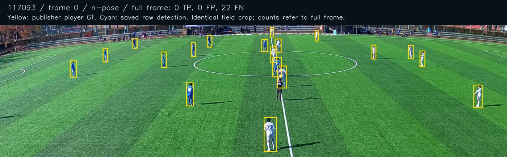
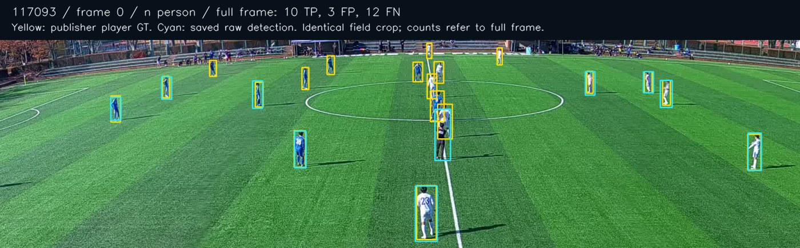

# Small-player experiment protocol (2026-10-02)

## Integration baseline

PR #1 was open, mergeable, targeted main and had successful run36928035973 at e65bbfd. It was merged using a merge commit d03a2700317c751ea50bbb050a584801fd215d77. PR #2 was retargeted from revive/scout-ai to main without rewriting commits; the diff remained five commits /39 files. Its hypothetical merge tree equalled its existing head tree. After retargeting, 58 pytest tests, Ruff, compileall, frontend ci/lint/build, demo E2E, real CPU smoke and all three opt-in football reruns passed. Raw/tracked TP/FP/FN matched the previous report exactly. Successful CI run36933062448 remained associated with its unchanged head. PR #2 was merged as24a389bad4aa2b777f04eb8fe25c1b895e680b07. Main was clean and identical in content to44c4558; historical branches were retained.

New work is on cv/small-player-detection from main24a389b. See existing FOOTBALL_VALIDATION.md for the previous stage, including rejected tracker/ankle changes and movement safety.

## Preregistered split and selection

Before any new-match inference: SoccerTrackv2 challenge clips117093 (B1 vsB2) and118575 (C1 vsC2) are DEV;118576 (D1 vsD2) is HOLDOUT. The publisher identifies these as different university matches; dates are unavailable. First120 decoded frames of each are selected by a fixed rule, without consulting model output. Existing UVY steady/zoom are previously seen DEV diagnostics for pan/zoom/crowd tradeoffs; they are never holdout. No training/fine-tuning is planned.

Score raw player detection separately from tracker-confirmed boxes at IoU>=.5 using the existing scorer. Primary criterion: DEV football-player F1, checking each clip's recall and FP counts, small-player recall, runtime and identity continuity. A precision increase that discards players, or recall increase with excessive FP, does not qualify. Do not invent a composite score. Freeze the candidate configuration before opening HOLDOUT metrics; run only baseline and that frozen candidate on HOLDOUT, with no retuning afterwards. Failure of HOLDOUT rejects the production change and is retained as evidence.

Small-player reference: GT area scaled to a1280px maximum image dimension <=32^2 pixels (fixed reference resolution independent of candidate imgsz). Report matched TP/FN/recall, not small-player precision: unmatched predictions do not have a reliable GT size category. Publisher challenge GT is0-based with22player/GK identities and -1 placeholders; no referee/ball positives. Inspect alignment on raw frames before inference. Human expertise/completeness uncertainty must be disclosed.

## Limited matrix

Baseline: current YOLO11n-pose, native640..1280 policy, conf.3, NMS.5, original BoT-SORT, no ROI.

DEV alternatives: (A) YOLO11s-pose at the same input; (B) YOLO11n person detector at the same input, bbox ground fallback for evaluation; (C) original pose at1920; (D) original pose with2x2 overlapping960px tiles and global NMS; (E) original pose plus conservative grass-envelope pitch filtering; (F) best viable detector/resolution plus the filter, if E's TP-loss tradeoff warrants it. These are opt-in harness configs, not active application defaults. Maximum two new weight files; no new CUDA packages. Reuse original BoT-SORT to measure how detector changes affect continuity, without repeating previously rejected tracker parameter searches. Stitching is conditional on identity errors becoming the dominant failure, and requires adequate identity GT.

Physical metrics remain subject to all existing timing, gap, calibration and camera gates. No compensation or new physical accuracy claim.

The split/protocol above was committed in9786577 before new-match inference. Results below are observations, not additions to the original selection criteria.

## Sources and exact windows

SoccerTrackv2 by Atom Scott, Ikuma Uchida, Kento Kuroda, Yufi Kim and Keisuke Fujii ([paper](https://arxiv.org/abs/2508.01802)). Dataset videos/annotations are explicitly [CC BY4.0](https://github.com/AtomScott/SoccerTrack-v2/blob/6f5c47cd3a5c38b074c44e9c98dfba48daa230d3/LICENSE-DATA). [Publisher match metadata](https://github.com/AtomScott/SoccerTrack-v2/blob/6f5c47cd3a5c38b074c44e9c98dfba48daa230d3/docs/matches.json) establishes different anonymous team pairs. Same university venue/camera family; three independent matches, not three camera domains.

Actual paired [Drive challenge README](https://drive.usercontent.google.com/download?id=16r-eRymdGQ4djv8FHqfJYW-LVQZJhz-0&export=download&confirm=t) specifies22players including goalkeepers, no referee/ball; actual GT frame0 was checked. Human box-review protocol is not specified. Raw DEV frames0/64 were inspected with publisher boxes before inference: visible player alignment was plausible; no embedded prediction overlays in raw video. This is publisher-label agreement, not independently expert-audited accuracy. GT files were not edited.

| Match / split | Original MP4 bytes / duration | Resolution / FPS | Derived window |
|---|---|---|---|
|117093 / DEV, B1 vsB2|304,980,773 /239.04s|4096x1080 /25|frames0..119 /4.8s|
|118575 / DEV, C1 vsC2|287,015,664 /240s|4096x1080 /25|frames0..119 /4.8s|
|118576 / HOLDOUT, D1 vsD2|298,409,129 /239s|4096x1080 /25|frames0..119 /4.8s|

`download_soccertrack_samples.py` downloads only first200 encoded samples' prefix plus final moov atom, with exact206/Content-Range checks. Patching the mdat extent creates a **partial decode cache**, whose later sample-table entries have no payload; it is not a complete valid original MP4. Only first120 decoded frames are converted to standalone MJPG AVI, retaining native resolution/FPS without interpolation. Source/cache/range/GT/derived hashes and exact video/GT URLs are in [source manifest](../validation/results/soccertrack-sources-2026-10-02.json). All caches/videos/full GT are ignored. Derived AVIs are169,067,570 /169,961,776 /169,355,780bytes locally; no source MP4 was downloaded in full.

New video ranges + full GT download: **49,469,883bytes**. Two new official [Ultralytics YOLO11](https://docs.ultralytics.com/models/yolo11/) weights: yolo11s-pose20,373,161bytes and yolo11n5,613,764bytes. Total sample/weight payload **75,456,808bytes**, below200MB; no CUDA install, new training dependency or additional model. Original n-pose weights remain unchanged.

## Baseline and DEV matrix

Current-main baseline uses unchanged actual VideoProcessor n-pose/conf.3/native640..1280/BoT-SORT. Tool-only additions do not alter the baseline processor. Baseline records git/model/video hashes; later experiment runs also freeze harness/processor hashes before inference. Baseline raw detection:

| Match | TP /FP /FN | P /R /F1 | Track IDs /median /short | FPS |
|---|---|---|---|---:|
|117093|0 /62 /2640|0 /0 /0|2 /29 /1|8.263|
|118575|0 /0 /2640|0 /0 /0|0 /0 /0|8.114|

Baseline GT identity continuity is N/A: no GT matches. All2640GT observations per match are small under the preregistered reference-size definition.

| DEV candidate |117093 raw TP/FP/FN /F1|118575 raw TP/FP/FN /F1| Approx FPS |
|---|---|---|---|
|Original n-pose|0/62/2640 /0|0/0/2640 /0|8.1–8.3|
|Larger s-pose, same input|0/0/2640 /0|0/0/2640 /0|5.7–5.8|
|n person, same input|1662/250/978 /.730228|832/232/1808 /.449244|8.4–8.6|
|n-pose1920|0/0/2640 /0|0/0/2640 /0|5.9–6.0|
|n-pose four960tiles +global NMS|0/120/2640 /0|0/0/2640 /0|5.3–5.4|
|n-pose +grass envelope|0/62/2640 /0|0/0/2640 /0|8.1|
|n person +grass envelope|1662/250/978 /.730228|832/232/1808 /.449244|8.1–8.2|

Grass envelope tests large connected green area, convex hull and border dilation; it passes through unknown scenes. It is not the marked playing-field boundary. On these DEV scenes, assistants stand on surrounding grass and referees on the pitch, so the filter retains them.

Previously seen UVY diagnostics expose the **unconditional** person model regression:

| Clip | Original n-pose TP/FP/FN /F1 | n person | n person +grass |
|---|---|---|---|
|steady|1217/264/1650 /.559798|2549/2524/318 /.642065|2549/2521/318 /.642308|
|zoom|53/571/387 /.099624|250/4108/190 /.104210|250/4102/190 /.104341|

The person model raises recall but produces far more unwanted people in broadcast scenes. The grass filter removes only3/6FP with no TP loss there, too little to justify a production filter. No human-category attribution is inferred from aggregate FP counts. Annotated frames show assistant/referee/spectator examples, but GT FP also includes localization mismatches and possibly incomplete labels.

## Frozen candidate and one HOLDOUT round

Candidate [configuration](../validation/configs/selected-small-player.json) frozen in **821e4111042593ec5a311997c83850483d156631**, before either HOLDOUT run: `CV_DETECTOR_POLICY=auto`; width>=1920 and aspect>=3 selects yolo11n person; other shapes retain configured MODEL_WEIGHTS, default n-pose. This is a conservative panoramic scope, not an automatic classifier of football content. Input cap/conf/NMS/BoT-SORT unchanged. No filter, tiling, ReID, kit classification or stitching. Bbox bottom centre is the person-model image position; optional pose retains existing ankle mean/fallback. New metadata/warning states approximate foot position.

Only baseline and frozen person candidate ran on118576. No subsequent candidate/configuration was evaluated or retuned on HOLDOUT. These two runs used actual VideoProcessor, with decoder timing and camera veto; the automatic dispatch later selects the same weights/config for this shape, covered by deterministic routing tests.

| HOLDOUT118576 |TP /FP /FN|Precision|Recall|F1|
|---|---|---:|---:|---:|
|Baseline raw|0 /0 /2640|0|0|0|
|Frozen candidate raw|1003 /316 /1637|.760425|.379924|.506694|
|Baseline tracked|0 /0 /2640|0|0|0|
|Frozen candidate tracked|910 /284 /1730|.762144|.344697|.474700|

This confirms small-player detection improvement in the held-out match at comparable CPU cost. All2640labelled observations are small; recall0→.379924. This is one4.8s window, not a global football score.

## Actual selected production and tracking

After HOLDOUT confirmation, auto became the default in c73b464. The actual auto-dispatched VideoProcessor was rerun on the two DEV matches; exact raw/tracked counts match the earlier person experiment. Broadcast/blur defaults are protected by scope and rerun separately.

| Match | Raw P /R /F1 | Tracked TP/FP/FN /F1 | IDs /median /short | Switches /fragments |
|---|---|---|---|---|
|117093 DEV|.869247/.629545/.730228|1591/224/1049 /.714254|32 /39.5 /6|8 /72|
|118575 DEV|.781955/.315152/.449244|804/208/1836 /.440307|22 /30 /5|8 /68|
|118576 HOLDOUT|.760425/.379924/.506694|910/284/1730 /.474700|36 /18.5 /10|18 /69|

Any-track frame coverage:11709348.3%→100%,1185750→100%,1185760→100%. This is not player recall or identity accuracy. Recovered matched player observations make identity failures measurable; zero baseline switches do not mean better continuity. Missing observations remain dominant (raw FN978/1808/1637), so conservative stitching cannot repair the main failure. New detections create8/8/18switches; reliable identity continuity remains unresolved. Prior rejected ByteTrack/BoT threshold experiments were not repeated; original tracker is retained.

## CPU performance and movement limits

Sequential actual-processor runs, no concurrent inference; includes decoding/tracking/camera/annotated JPEG output, excludes model import/load, upload, DB/gallery writes. RSS sampled after each frame, not a continuous peak. Alternative-model timings above are exploratory comparisons; these are final production pairs.

| Match |Before seconds /FPS|After seconds /FPS|RSS before→after MiB|After processing/video ratio|
|---|---|---|---|---:|
|117093|14.523 /8.263|14.419 /8.323|459.29→471.73|3.004|
|118575|14.790 /8.114|13.971 /8.589|457.90→456.99|2.911|
|118576|14.649 /8.192|13.969 /8.591|458.93→451.56|2.910|

Environment: Windows11, Python3.12, i7-13650HX, Torch2.10.0+cpu, Ultralytics8.4.26, OpenCV4.12.0, Supervision.27. CPU only; **CUDA NOT TESTED**, no realtime claim. All reference sizes/weights/hashes/configs/runtime/technical/GT counts/events are in [numeric evidence](../validation/results/small-player-2026-10-02.json).

No movement math, timing validation, gap segmentation, max plausible speed, homography validation or camera thresholds were changed. All real browser physical metrics remain unavailable. Bbox image position is approximate; precise feet and physical accuracy are **not validated**. Panoramic lens/stitching geometry can violate a single homography's assumptions; this stage provides no surveyed field/trajectory reference or motion compensation. No-motion is still only a veto result, not proof of metric accuracy.

## Rejected options and regression evidence

Larger pose/high resolution/tiled pose did not recover matched players on these windows and cost more CPU. Unconditional person default is rejected because broadcast FP rises substantially. Grass filtering is rejected as an active default because its measurable reduction is negligible. Referee/team-color classification has no independently labelled role/kit benchmark here; it was not added. No face identification, jersey OCR, cross-match identity or out-of-scope features.

Backend tests:77PASS, Ruff/compileallPASS; frontend ci/lint/buildPASS, npm audit0vulnerabilities. Ordinary CI remains weights/GPU-free. Full demo, CPU smoke and legacy broadcast E2E are separately recorded in VALIDATION.md after final execution.

Real panoramic E2E used the reviewed webapp-testing server helper, explicit absolute Python/Node executables and a temporary SQLite DB/env, REAL worker and actual automatic person model. Register/login/profile/save/refresh→169MBvalid AVI upload202→queue/processing/gallery/selection→uncalibrated report/path/heatmap/preview/refresh→logout/scout/search/detail/guards. ID1:120observed frames,40stored samples; fixed-camera classifier returned no_motion_detected, physical metrics null without calibration. Happy path has no console/page/HTTP/image errors or stuck worker; intentional invalidJWT401 is separate. Screenshots/overflow assertions at1440/768/390; desktop/mobile visually checked. First attempt incorrectly expected a report with enabled calibration and no stationary confirmation: UI correctly disabled submission. Test now asserts that block, then disables calibration and continues with supported image coordinates. No production gate was weakened to pass it.

Attribution/evidence: raw clips and GT by SoccerTrackv2 authors under CC BY4.0; ScoutAI trims/re-encodes/draws overlays. Small figures under docs/football/small-player; full outputs ignored in test-artifacts/small-player. No endorsement implied.

Same DEV117093 frame0/crop, publisher boxes in yellow and saved raw detections in cyan. Counts in headers cover the full frame, not only the crop; this representative is not the aggregate benchmark.




[Visually checked390px real report](football/small-player/report-mobile.png) shows unavailable physical metrics, image coordinates and the bbox-foot warning. The observed-frame percentage is visibility of one ID, not detection accuracy.

## Reproduce and next step

```powershell
.\.venv\Scripts\python.exe scripts/download_soccertrack_samples.py
.\.venv\Scripts\python.exe scripts/download_model.py --model yolo11n.pt
.\.venv\Scripts\python.exe scripts/download_model.py --model yolo11s-pose.pt
# Old-main baseline is explicit after the new automatic default:
.\.venv\Scripts\python.exe scripts/validate_football_cv.py test-artifacts/football/soccertrack/117093/window/clip.avi --production --model backend/weights/yolo11n-pose.pt --output test-artifacts/small-player/repro-baseline
.\.venv\Scripts\python.exe scripts/validate_football_cv.py test-artifacts/football/soccertrack/117093/window/clip.avi --production --output test-artifacts/small-player/repro-current
.\.venv\Scripts\python.exe scripts/score_soccertrack.py test-artifacts/small-player/repro-current --gt test-artifacts/football/soccertrack/117093/gt.txt
.\.venv\Scripts\python.exe scripts/run_small_player_matrix.py --candidate person person-pitch --clips 117093 118575
.\.venv\Scripts\python.exe scripts/test_e2e.py --video test-artifacts/football/soccertrack/117093/window/clip.avi
```

Replay creates a new experimental round; do not use the already opened118576 as an untouched future holdout. For further tuning acquire a new sealed match/window, preferably another venue/camera, expert-audited boxes/IDs and labelled on-/off-pitch roles. Evaluate a user-assisted playing-field boundary separately from grass detection, and improve remaining small-player recall before identity stitching. Physical validation remains a distinct task with measured references. This stage did not establish general broadcast player filtering or stable identity.

Skills: grill-me redirects to grilling; factual source discovery delegated per its instructions, user-specified autonomy/selection rules settled decisions. Webapp-testing governed real Chromium/server/DOM/console checks; frontend-design retained existing tokens/layout for one honest bbox position note (see DESIGN.md). Handoff references this report and Git/CI status in the OS temp directory.
